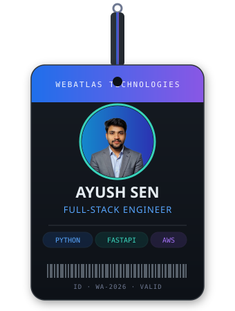

<picture>
  <source media="(prefers-color-scheme: dark)" srcset="./ayush-banner.svg">
  <source media="(prefers-color-scheme: light)" srcset="./ayush-banner-light.svg">
  
</picture>

 

<picture>
  <source media="(prefers-color-scheme: dark)" srcset="https://readme-typing-svg.demolab.com/?font=Fira+Code&weight=600&size=20&duration=3000&pause=800&color=58A6FF&center=true&vCenter=true&width=700&height=50&lines=Building+scalable+SaaS+%26+AI-powered+products;React+%C2%B7+Next.js+%C2%B7+NestJS+%C2%B7+Laravel+%C2%B7+AWS;Turning+ideas+into+production-ready+software">
  
</picture>

 

<table align="center" border="0">
<tr>
<td width="36%" align="center" valign="middle">

</td>
<td width="64%" valign="middle">

### 🧩 What I Build

| Focus Area | Stack |
|:---|:---|
| Scalable SaaS Platforms | `React` `Next.js` `NestJS` |
| Business & Enterprise Apps | `Node.js` `Laravel` `PostgreSQL` |
| REST & GraphQL APIs | `Express` `NestJS` `MongoDB` |
| AI-Powered Integrations | `Node.js` `REST APIs` |
| Cloud-Native Deployments | `AWS` `Docker` `GitHub Actions` |

 

> 💡 *"Great engineering isn't measured by the amount of code written, but by the impact the product creates for the people who use it."*

</td>
</tr>
</table>

 

### 🛠 Tech Stack

 

 

  

### 📊 GitHub Stats & Graphs

  

  

### 🐍 Contribution Snake

<!-- Populates after the "Generate Snake" workflow runs once (Actions tab -> Generate Snake -> Run workflow) -->
<picture>
  <source media="(prefers-color-scheme: dark)" srcset="https://raw.githubusercontent.com/WebatlasAshu/WebatlasAshu/output/github-contribution-grid-snake-dark.svg">
  
</picture>

  

### 📫 Connect

  

  

*"Building software isn't just about writing code. It's about creating solutions that people trust and businesses rely on."*

